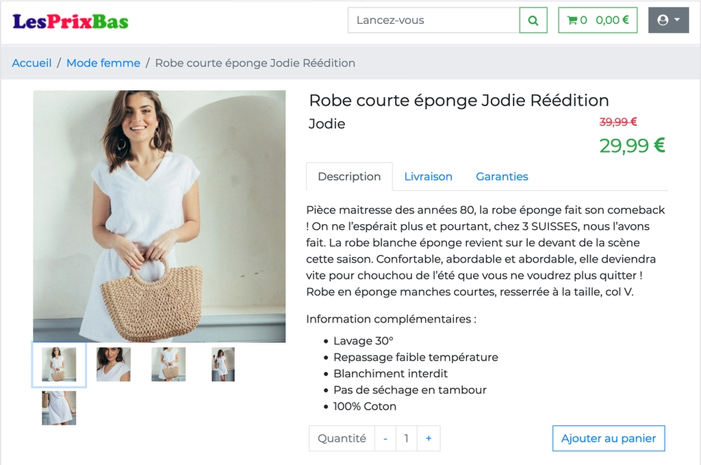

# LesPrixBas



## 1 - Installation

### 1.1 - Pré-requis

Vous avez un serveur de base de données **MySQL** fonctionnel et accessible sur localhost.

Vous avez **PHP** en version **8** minimum ainsi que **Composer**.

Votre environnement de développement est sous **Linux**, **MacOS** ou **Windows WSL 2**.

Le projet est développé à l'aide de **Laravel 8**.

Le cache applicatif est géré par **Memcached**. Le serveur Memcached doit être installé et mis en service. L'extension **php-memcached** doit être installée.

### 1.2 - Installation

Clonez le repo :

```zsh
git clone https://github.com/david-blanchard/les-prix-bas.git
```

Installez les dépendances :

```zsh
composer u
```

## 2 - Phase de test

Passez en mode test

```zsh
php artisan config:cache --env=testing
```

### 2.1 - Migration des données


Dans le fichier .env.testing, modifiez les accès **MySQL** pour refléter vos paramètres de connexion afin que les migrations en base s'effectuent sans problème.

> `DB_USERNAME=`**root**

> `DB_PASSWORD=`**demo**

Créez la base de données de test

```zsh
php artisan db:create
```

Créez la structure de la base de données de test

```zsh
php artisan migrate
```

Injectez les données de test

```zsh
php artisan db:seed
```
### 2.2 - Test

Lancez le test

```zsh
php artisan test
```

Résultat attendu :

```zsh
PASS  Tests\Unit\CampaignOneTest
✔️ campaign one exists
✔️ campaign one discount rate is 15 percents

PASS  Tests\Unit\ProductOneTest
✔️ product one exists
✔️ product one is veste en jean
✔️ product one is not robe
✔️ product one price is 38 euros

PASS  Tests\Feature\ProductModelTest
✔️ product pantalon is created without image
✔️ product pantalon without image is deleted
✔️ product pantalon is created with images
✔️ product pantalon with images is deleted in cascade

PASS  Tests\Feature\RouteTest
✔️ mode femme page is found
✔️ mode femme page with valid slug veste is found 1 of 3
✔️ mode femme page with valid slug robe is found 2 of 3
✔️ mode femme page with valid slug maille is found 3 of 3
✔️ mode femme page with invalid slug pantalon is 404
✔️ admin ui redirect to login as guest
✔️ admin ui request as admin is valid
✔️ admin ui edit product one is valid

PASS  Tests\Feature\UserModelTest
✔️ registration with email is valid
✔️ registration without email is invalid

Tests:  20 passed
Time:   1.21s
```

## 3 - Mode developer

Créez un fichier d'environnement dev avec le fichier test

```zsh
cp .env.testing .env
```

Editez le fichier .env pour changer quelques valeurs qui caractérisent l'environnement de test : 


> `<< APP_ENV=`**test**

> `>> APP_ENV=`**local**

> `<< DB_CONNECTION=mysql`**_testing**

> `>> DB_CONNECTION=mysql`

> `<< DB_DATABASE=lesprixbas`**_test**

> `>> DB_DATABASE=lesprixbas`


Quittez le mode test

```zsh
php artisan config:cache
```

### 3.1 - Migration des données


Créez la base de données lesprixbas

```zsh
php artisan db:create
```

Créez la structure de la base de données

```zsh
php artisan migrate
```

Injectez les données

```zsh
php artisan db:seed
```

### 3.2 - Lancement du projet

```zsh
php artisan serve
```
## 4 - LesPrixBas côté visiteur

L'application s'ouvre sur la page produit Veste en jean de la catégorie Mode Femme.

3 produits sont prédéfinis, ils peuvent être sélectionnés par la barre de recherche avec les mots-clés : veste, robe ou maille. La sélection peut aussi se faire directement dans la barre d'URL sous la catégorie /mode-femme/. Deux des trois produits affichent un prix remisé.

### 4.1 - La barre de recherche

Toute simple, elle permet de retrouver les autres produits créés en base sans passer par la barre d'URL du navigateur. Techniquement, la recherche se fait par une simple requête SELECT/LIKE. Elle n'était pas demandée mais je l'ai trouvée nécessaire. Il aurait été compliqué de sélectionner le produit voulu dans la barre d'URL en tapant le slug complet.

### 4.2 - L'authentification 

J'ai utilisé le système d'authentification embarqué dans Laravel 8 qui est d'une simplicité maximum tout en étant complet. La connexion fait la différence entre un utilisateur lambda et admin. Toutes les inscriptions sont lambda. Le login admin est géré directement en base (voir le fichier AdminSeeder.php).

### 4.3 - Le panier

On peut ajouter autant de produits que l'on veut au panier. Le total tient compte des prix remisés. Tout se passe en backend. 

A chaque clic sur "Ajouter au panier" une requête ajax envoie un objet JS contenant le type d'objet de session à stocker (ici Cart), la quantité de produits à ajouter et l'ID du produit. Côté backend, l'objet de session Cart est retrouvé et s'il était déjà rempli le total des prouits est calculé en tenant compte des remises et des quanittés pour chaque produit figurant dans le panier. Une fois le calcul de panier fait, il est renvoyé côté client avec les deux seules informations : quantité, total. C'est une fonction JS qui fait l'affichage du panier.

La suppression des produits du panier ou la diminution des quantités ne sont pas implémentées, une page dédiée au panier serait plus simple pour ces opérations.

Le panier est conservé tout au long de la session quand le visiteur est authentifié. Il est vidé quand le client se déconnecte.

## 5 - Côté admin

Sur les trois produits en base, les deux derniers n'ont pas d'image associée afin de montrer comprendre comment ça marche. Il est aussi possible de créer de nouveaux produits, images et marques. Pour cela il faut passer côté admin en se connectant avec les identifiants admin@lpb.fr/demo. 

### 5.1 - Gérer les produits

Lors de la connexion admin on reste sur la page produit, pour passer dans l'admin UI il faut sélectionner la rubrique Admin UI du menu déroulant utilisateur.

Allez à la rubrique "Gérer les produits". Chosissez un produit à modifier ou créez-en un nouveau en cliquant sur l'icône bleue à côté de Produits.

Lors de la création, une validation des champs a été ajoutée via une ProductsRequest.

On doit renseigner : 
- le nom du produit (255 car. max)
- la description (1000 car. max)
- une liste énumérée de petites phrases séparées par des point-virgules donnant des détails (optionnel, 1000 car. max)
- un prix décimal supérieur à 0
- une marque sélectionnée parmi celles existantes

Les images ne peuvent pas être assoiciées au moment de la création du produit du fait des relations entre les tables. Le produit doit être créé avant que les images lui soit associées.

Les propriétés d'affichage du produit sont conservées en cache applicatif. Le produit est supprimé du cache après une modification ou une suppression depuis l'Admin UI. Le produit est remis en cache lorsqu'il est rappelé par la page produit.

### 5.2 - Associer des images à un produit

Lors de la connexion admin on reste sur la page produit. On peut voir sous les images un bouton "Ajouter des images au produit". On arrive sur la page de gestion des images par produit. Les images sont déjà enregistrées en base pour les trois produits prédéfinis, il n'y a qu'à les associer en rapport avec le nom du produit.

### 5.3 - Ajouter des images

On peut ajouter d'autres images dans la rubrique "Gérer les images".

Le formulaire attend une URL et deux descriptions pour les tag alt et title (SEO).

L'URL peut être une image externe ou un chemin relatif vers un fichier stockés dans les assets du site. Pour le test, toutes images sont stockées dans les assets.

### 5.4 - Ajouter une marque

Le formulaire ne comporte que le champ nom. Il est utile de passer par ce formulaire avant de créer de nouveaux produits afin de sélectionner la bonne marque pour le bon produit. Il est toutefois possible de modifier le produit pour changer la marque.

### 5.5 - Les campagnes de promos

J'ai ajouté une table Campaigns pour gérer les remises et CampaignProducts pour la relation avec les produits. Il m'a semblé plus simple de mettre en place ce dispositif pour la gestion du panier et la clareté de code que de mettre en dur une remise de 25% par exemple qui devait être gérée à la fois côté Front et Back.

### 5.6 - Fonctionnalités non prises en charge

La suppression de l'association d'une image à un produit n'a pas été implémentée.

La modification et la suppression d'une image n'ont pas été implémentées.

La modification et la suppression d'une marque n'ont pas été implémentées.

La gestion complète des campagnes de promos n'est pas implémentée.
